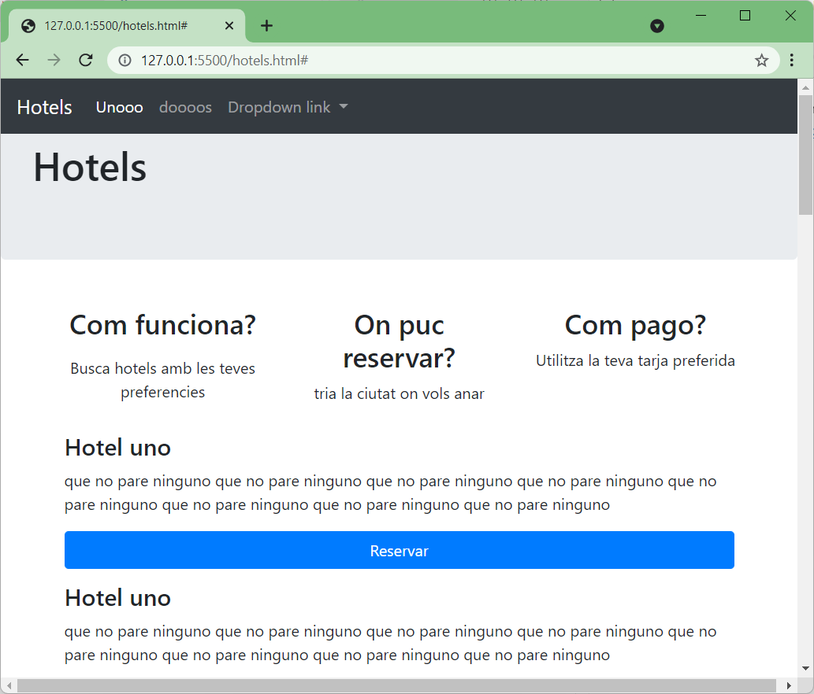

# MP05 UF01: Activitat Hotels

1. Crear un grup de dos alumnes.
1. Crear una carpeta local a l'ordinador de l'alumne que apareix abans a la llista. (*A partir d'ara serà l'***alumne A***.*)
1. A l'ordinador de l'***alumne A***, cal fer un ```git clone``` de [https://github.com/joanpardogine/MP05UF01_ActivitatHotels.git](https://github.com/joanpardogine/MP05UF01_ActivitatHotels.git)

   1. El ```clone``` us ha creat un repositori al vostre ordinador.
   1. I també ha creat un enllaç (anomenat ```origin```) dirigit cap al meu repositori.
   1. Un cop tigueu el repositori remot clonat al vostre ordinador, cal que elimineu l'enllaç ```origin```.

A la compta de github.com l'***alumne A*** cal:
1. Crear un repositori remot.
    1. Nom **repositori**:

       ***```<Cognom de l'alumne A>_<Cognom de l'alumne B>_Act_Hotels```*** 
    1. El repositori serà de tipus: **```Privat```**.
    1. Cal convidar:
        1. al company de grup i
        1. a l'usuari ***```joanpardogine```***


## **Estat inicial de la web**

En aquests moments aquest el l'aspecte de la vostra web.



I a quasevol dels vostres repositoris, només hi ha branca **```main```**.


## **1r pas**

Cal que cadascun del alumnes crei una nova branca **des de** la branca **```main```**.

1. ***```git checkout -b <nomDeLaNovaBranca>```***
1. El nom de la nova branca será diferent, depenent de cada alumne: **```CognomAfegirMevaInformacio```**
1. Tasques a fer (**cada alumne a la seva branca**)
    1. Crear una nova pàgina **```HTML```** (**```cognom.html```**) amb la vostra informació.
    1. Tingeu en compte que la pàgina web de cada alumne cal que tingui el mateix menú de navegació i el mateix footer.
    1. Cal fer el canvis necessaris al menu de **```hotels.html```** per afegir un enllaç que vaig a la nova pàgina **```HTML```** de cadascun dels alumnes.
    1. I aquests enllaços cal que apareguin al menú desplegable, que ara té el nom **```Dropdown link```**, i aquest nom ara serà  **```Sobre nosaltres...```**.


## **2n pas**

Cal que cadascun del alumnes crei un **```pull request```**, de la seva banca a la branca **```main```** des del repositori remot. I si apareix algún conflicte, cal que els resolgui.

Un cop que cada alumne ha creat el **```pull request```** de la seva banca al **```main```**, cal que executi el **```merge```** que ha creat el seu company.
D'aquesta manera un alumne crearà un **```pull request```** de la seva branca i executarà el **```merge```** de la branca del seu company.


## **3n pas**

Cal que cadascun del alumnes crei dues branques noves al seu repositori local.
1. A una branca crearà una pàgina web a un hotel.
1. A la segona branca crearà una pàgina web a una de les dues accions **```Com funciona```** o **```On puc reservar```**.
1. I en ambdós casos caldrà, modificar el nav del fitxer **```hotel.html```**.

I com en el **Pas 2**:

Cal que cadascun del alumnes crei un **```pull request```**, per cadascuna de les seves branques a la branca **```main```** des del repositori remot. I si apareix algún conflicte, cal que els resolgui.

Un cop que cada alumne ha creat els dos **```pull request```** de les seves branques al **```main```**, cal que executi el dos **```merge```** que ha creat el seu company.
D'aquesta manera un alumne crearà dos **```pull request```** de les seves branques i executarà els dos **```merge```** de les dues branques del seu company.